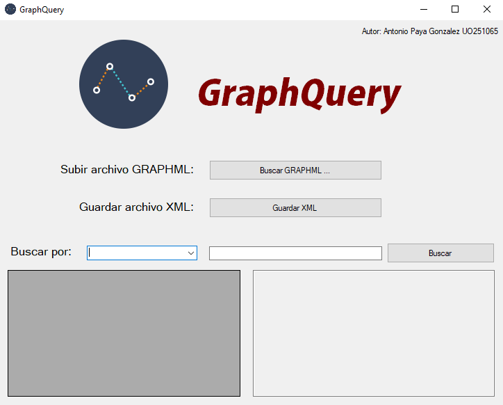

# GraphQuery
--------------------

## Graphml
--------------------
Es un formato de archivo basado en XML especializado para grafos. El formato de archivo Graphml se creó con el fin de definir un formato común para el intercambio de datos de estructura de grafos. Admite todo el rango de posibles constelaciones de estructura de grafos, incluidos grafos dirigidos, no dirigidos, mixtos, hipergramas y atributos específicos de la aplicación.

Un ejemplo de aplicación con Graphml es usando el sistema gestor de bases de datos no relacionales Neo4J, que guarda los datos en formato de grafo, y le podemos pedir que nos devuelva una instancia de dicha base de datos en un archivo Graphml.
El problema que tiene dicho formato es su sintaxis, ya que con el fin de permitir máxima flexibilidad, es algo difícil de entender para un ser humano que tenga que leerlo, por lo que la aplicación GRAPHQUERY se encarga de traducirlo a un archivo XML con una sintaxis más sencilla.

## GraphQuery
--------------------
La aplicación está desarrollada en C# con el framework de .NET v4.6.1, utilizando VisualStudio2017.
1. El código fuente está alojado en la carpeta Source
2. El ejecutable está alojado en la carpeta Ejecutable
3. Los archivos de prueba están alojados en la carpeta XML-Files

La aplicación tiene un funcionamiento sencillo. En primer lugar, debemos cargar el fichero Graphml sobre el que debemos trabajar por medio del botón cargar Graphml.
Una vez cargado dicho archivo la aplicación muestra automáticamente los datos de los nodos en la tabla y rellana el combo box con los posibles campos que podemos usar para buscar un nodo concreto del grafo (por medio de sus atributos y etiquetas).
Si queremos generar el XML lo tenemos que pulsar sobre el botón “GenerarXML” y nos pedirá un nombre y lugar para guardarlo.
